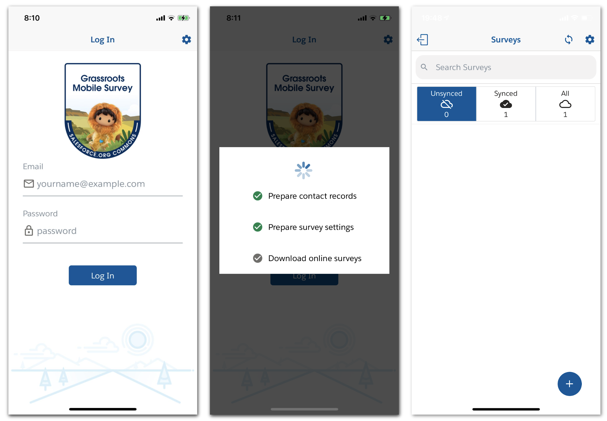

)
# Grassroots Mobile Survey App

The Grassroots Mobile Survey App is focused on providing affordable field survey capacity to nonprofits worldwide. For project information, install instructions and documentation, please visit our [wiki](https://github.com/SFDO-Community-Sprints/GrassrootsMobileSurveyApp/wiki)

For Open Source Community Sprint work on the Salesforce application associated with this project, please see repo [@SFDO-Community-Sprints/GrassrootsSurveySalesforcePackage](https://github.com/SFDO-Community-Sprints/GrassrootsSurveySalesforcePackage)
For further information on the projects authentications and Heroku usage see repo: [@SFDO-Community-Sprints/GrassrootsSurveyHerokuAuth0LoginApi](https://github.com/SFDO-Community-Sprints/GrassrootsSurveyHerokuAuth0LoginApi)
